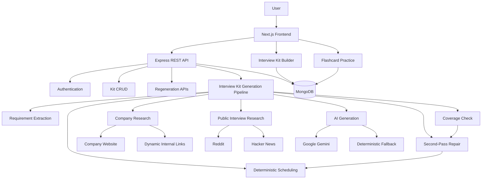

# Trao AI Interview Prep Kit

An AI-powered interview preparation application that transforms a job description and company website into a personalized interview preparation kit.

The application extracts role requirements, researches the company and public interview information, generates interview questions and flashcards, checks requirement coverage, repairs uncovered requirements through a second generation pass, creates a deterministic preparation schedule, and provides an editable Builder and adaptive Flashcard Practice experience.

---

## Table of Contents

- [Overview](#overview)
- [Features](#features)
- [Technology Stack](#technology-stack)
- [Architecture](#architecture)
- [Project Structure](#project-structure)
- [Application Flow](#application-flow)
- [Authentication](#authentication)
- [Requirement Extraction](#requirement-extraction)
- [Company Research](#company-research)
- [Public Interview Research](#public-interview-research)
- [Generation Pipeline](#generation-pipeline)
- [Coverage Checking](#coverage-checking)
- [Second-Pass Coverage Repair](#second-pass-coverage-repair)
- [Deterministic Scheduling](#deterministic-scheduling)
- [Interview Kit Structure](#interview-kit-structure)
- [Builder](#builder)
- [Regeneration](#regeneration)
- [Flashcard Practice](#flashcard-practice)
- [API Endpoints](#api-endpoints)
- [Validation](#validation)
- [Security](#security)
- [Error and Edge Case Handling](#error-and-edge-case-handling)
- [AI / LLM Configuration](#ai--llm-configuration)
- [Environment Variables](#environment-variables)
- [Local Setup](#local-setup)
- [Running the Application](#running-the-application)
- [Testing](#testing)
- [Batch Evaluation](#batch-evaluation)
- [Batch Input Format](#batch-input-format)
- [Batch Output Format](#batch-output-format)
- [Production Build](#production-build)
- [Deployment](#deployment)
- [Deployment Checklist](#deployment-checklist)
- [Design Decisions and Tradeoffs](#design-decisions-and-tradeoffs)
- [Creative Feature](#creative-feature)
- [Known Limitations](#known-limitations)
- [Current Verification Status](#current-verification-status)
- [Walkthrough](#walkthrough)
- [Submission Checklist](#submission-checklist)

---

# Overview

Trao AI Interview Prep Kit is a full-stack web application designed to help candidates prepare for interviews using information specific to a target role and company.

The application accepts:

- Job description
- Company website
- Company
- Role
- Location
- Number of preparation days

It then runs a multi-step pipeline:

```text
Job Description
      |
      v
Requirement Extraction
      |
      v
Company Research
      |
      v
Public Interview Research
      |
      v
Interview Content Generation
      |
      v
Coverage Check
      |
      v
Second-Pass Coverage Repair
      |
      v
Deterministic Schedule
      |
      v
Validated Interview Kit
      |
      +--------------------+
      |                    |
      v                    v
   Builder             Practice
```

The resulting kit can be edited, regenerated, practiced, and persisted for future sessions.

---

# Features

## Authentication

- User registration
- User login
- User logout
- Session-based authentication
- Protected kit routes
- User-specific kit ownership

## Kit Creation

Users can create an interview kit from:

- Job description
- Company
- Company website
- Role
- Location
- Preparation days

## Requirement Extraction

The system extracts:

- Role title
- Seniority
- Responsibilities
- Technical requirements
- Behavioural requirements
- Domain requirements
- Must-have requirements
- Nice-to-have requirements

## Company Research

The research pipeline includes:

- Company website retrieval
- robots.txt handling
- Dynamic link discovery
- Link ranking
- Same-host crawl restrictions
- Content cleanup
- Source tracking
- Retry and backoff
- Content-type validation
- Response-size limits

## Public Interview Research

The research layer can also retrieve publicly available interview discussion from supported public sources.

The current implementation includes public retrieval from:

- Reddit
- Hacker News

## Interview Content Generation

The system generates:

- Interview questions
- Answer outlines
- Question categories
- Difficulty levels
- Flashcards

## Coverage

The system checks whether generated questions cover extracted requirements.

Uncovered requirements can trigger a second generation pass.

## Scheduling

The application generates deterministic preparation schedules for:

- 1 day
- 2–60 days

The schedule contains:

- Day
- Focus
- Question IDs
- Integer minutes

## Builder

Users can:

- Edit company brief
- Edit questions
- Edit answer outlines
- Change question category
- Change question difficulty
- Reorder questions
- Pin and unpin questions
- Add questions
- Delete questions
- Regenerate questions by category
- Regenerate the company brief
- Regenerate the schedule
- Edit flashcards
- Pin and unpin flashcards
- Add flashcards
- Delete flashcards

## Flashcard Practice

The Practice experience supports:

- One flashcard at a time
- Answer reveal
- Confidence rating from 1–5
- Persistent practice state
- Covered/uncovered status
- Lower-confidence-first ordering for future practice sessions

## Batch Evaluation

The project includes the required batch evaluator entry point:

```bash
npm run evaluate -- --input cases.json --output kits.json
```

The evaluator processes multiple cases and continues processing after individual case failures.

---

# Technology Stack

## Frontend

- Next.js
- React
- TypeScript
- Tailwind CSS

## Backend

- Node.js
- Express
- TypeScript
- MongoDB
- Mongoose

## Validation

- Zod

## Authentication / Sessions

- Express Session
- MongoDB-backed session storage
- Password hashing

## AI

- Google Gemini
- `@google/genai`

## Research / Retrieval

- HTTP-based website retrieval
- robots.txt handling
- Dynamic link discovery and ranking
- Reddit public data
- Hacker News public search
- Retry and backoff logic
- Response validation
- SSRF/private-network protection

---

# Architecture



---

# Project Structure

```text
trao-interview-prep-kit/
│
├── apps/
│   │
│   ├── api/
│   │   │
│   │   ├── src/
│   │   │   ├── controllers/
│   │   │   ├── middleware/
│   │   │   ├── models/
│   │   │   ├── routes/
│   │   │   ├── services/
│   │   │   │   ├── extraction/
│   │   │   │   ├── generation/
│   │   │   │   ├── kit-generation/
│   │   │   │   ├── research/
│   │   │   │   └── scheduling/
│   │   │   ├── tests/
│   │   │   ├── validators/
│   │   │   ├── evaluate.ts
│   │   │   └── server.ts
│   │   │
│   │   ├── .env.example
│   │   └── package.json
│   │
│   └── web/
│       │
│       ├── src/
│       │   ├── app/
│       │   │   ├── dashboard/
│       │   │   │   ├── page.tsx
│       │   │   │   └── create-kit/
│       │   │   ├── kits/
│       │   │   │   └── [id]/
│       │   │   │       ├── page.tsx
│       │   │   │       └── practice/
│       │   │   │           └── page.tsx
│       │   │   ├── login/
│       │   │   ├── register/
│       │   │   └── page.tsx
│       │   │
│       │   └── lib/
│       │       └── api.ts
│       │
│       └── package.json
│
├── packages/
├── pipeline/
├── tests/
├── package.json
├── package-lock.json
├── .gitignore
└── README.md
```

---

# Application Flow

The complete application flow is:

```text
1. Register / Login
        |
        v
2. Dashboard
        |
        v
3. Create Interview Kit
        |
        v
4. Submit JD + Company URL + Role + Location + Days
        |
        v
5. Extract Requirements
        |
        v
6. Research Company
        |
        v
7. Research Public Interview Information
        |
        v
8. Generate Questions + Flashcards
        |
        v
9. Calculate Requirement Coverage
        |
        v
10. Generate Missing Questions
        |
        v
11. Re-check Coverage
        |
        v
12. Build Deterministic Schedule
        |
        v
13. Validate Kit
        |
        v
14. Persist to MongoDB
        |
        +----------------------+
        |                      |
        v                      v
15. Builder              16. Practice
```

---

# Authentication

The application uses session-based authentication.

## Supported operations

```text
POST /api/auth/register
POST /api/auth/login
POST /api/auth/logout
GET  /api/auth/me
```

Protected kit operations require authentication.

Kit queries are scoped to the authenticated user so that one user cannot access another user's kit.

Authentication failures are handled by the frontend by redirecting the user to the login experience.

---

# Requirement Extraction

The extraction layer is responsible for turning free-form job descriptions into structured role information.

## Extracted fields

```text
Role title
Seniority
Responsibilities
Requirements
```

## Requirement kinds

```text
technical
behavioural
domain
```

## Requirement priorities

```text
must
nice
```

## Example

```json
{
  "id": "req-001",
  "text": "Python",
  "kind": "technical",
  "priority": "must"
}
```

The extractor also supports:

- Explicit requirement sections
- Inline requirement sections
- Responsibilities
- Nice-to-have sections
- Duplicate removal
- Stable requirement IDs
- Thin job descriptions

The extractor is designed not to fabricate technologies when the job description does not provide them.

---

# Company Research

The research layer is separated from generation.

## Research sequence

```text
Company URL
    |
    v
Validate URL
    |
    v
Validate robots.txt
    |
    v
Fetch initial page
    |
    v
Extract links
    |
    v
Rank links dynamically
    |
    v
Fetch relevant same-host pages
    |
    v
Clean retrieved text
    |
    v
Store sources
```

## Research controls

The research implementation includes:

- HTTP/HTTPS URL validation
- Private/loopback destination protection
- robots.txt checks
- Retry handling
- Backoff handling
- Request throttling
- Response-size limits
- Content-type validation
- Same-host restrictions
- Dynamic link ranking
- Source tracking

The crawler does not depend on a fixed list of hard-coded company paths.

For example, instead of assuming that every company has:

```text
/about
/careers
/jobs
```

the crawler discovers links from retrieved pages and ranks them according to relevance.

---

# Public Interview Research

The application supplements company website research with publicly available interview discussion where accessible.

Current supported public retrieval sources include:

```text
Reddit
Hacker News
```

Public source retrieval is treated as optional research.

If a public source is unavailable or inaccessible:

- The application does not treat the source as successfully retrieved.
- Available research is preserved.
- Missing information is not silently fabricated.

---

# Generation Pipeline

The generation service is separate from retrieval and extraction.

## Pipeline

```text
JD
 |
 v
Requirement Extraction
 |
 v
Company Research
 |
 v
Public Discussion Research
 |
 v
Question Generation
 |
 v
Flashcard Generation
 |
 v
Coverage Check
 |
 v
Second-Pass Repair
 |
 v
Deterministic Scheduling
 |
 v
Validation
 |
 v
Persistence
```

The application uses the full pipeline for normal kit creation and for the batch evaluator.

---

# Coverage Checking

Coverage is determined in application code.

Each question can reference one or more requirement IDs.

Example:

```json
{
  "id": "question-001",
  "requirement_ids": [
    "req-001",
    "req-002"
  ]
}
```

Coverage is calculated by checking whether each requirement is represented by generated questions.

The resulting coverage object contains:

```json
{
  "uncovered_requirement_ids": [],
  "passes": 2
}
```

The final coverage arithmetic is intentionally deterministic rather than delegated to an LLM.

---

# Second-Pass Coverage Repair

The first generation pass may not cover every requirement.

The application therefore performs a second validation step:

```text
First Generation
      |
      v
Coverage Check
      |
      +---- Fully Covered ----> Continue
      |
      +---- Gaps Found -------> Generate Missing Questions
                                      |
                                      v
                                Coverage Check
                                      |
                                      v
                                   Continue
```

This allows uncovered requirements to trigger targeted question generation.

The kit is then validated again before being persisted.

---

# Deterministic Scheduling

The preparation schedule is generated by application code.

The LLM is not responsible for arithmetic schedule allocation.

## Schedule input

```text
Preparation days
Question set
Requirements
Question difficulty
Requirement priority
```

## Schedule output

```json
{
  "days_available": 7,
  "days": [
    {
      "day": 1,
      "focus": "Core technical requirements",
      "question_ids": [
        "question-001",
        "question-002"
      ],
      "minutes": 45
    }
  ]
}
```

## Schedule properties

The schedule is designed to:

- Contain exactly the requested number of days
- Use valid question IDs
- Prioritize must-have requirements
- Prioritize harder questions earlier
- Use integer minute values
- Produce deterministic results

Supported schedule range:

```text
1–60 days
```

---

# Interview Kit Structure

The generated kit follows this structure:

```text
source
company_brief
role
questions
flashcards
schedule
coverage
```

## Source

```text
company
company_url
role
location
jd_chars
researched_at
pages_used
```

## Company Brief

```text
summary
what_they_do
sources
```

## Role

```text
title
seniority
responsibilities
requirements
```

## Requirements

```text
id
text
kind
priority
```

## Questions

```text
id
requirement_ids
category
prompt
answer_outline
difficulty
edited
pinned
```

Supported question categories:

```text
technical
behavioural
system-design
company-fit
```

Difficulty:

```text
1 = Easy
2 = Medium
3 = Hard
```

## Flashcards

```text
id
front
back
requirement_ids
edited
pinned
confidence
covered
```

## Schedule

```text
days_available
days
```

## Coverage

```text
uncovered_requirement_ids
passes
```

---

# Builder

The Interview Kit Builder is the main editing interface.

## Company Brief Editing

Users can edit:

- Summary
- What They Do

The company brief can also be regenerated.

## Question Editing

Users can:

- Edit the question prompt
- Edit answer outline
- Change category
- Change difficulty
- Move question up
- Move question down
- Pin question
- Unpin question
- Delete question
- Add question
- Regenerate by category

## Flashcard Editing

Users can:

- Edit front
- Edit back
- Pin flashcard
- Unpin flashcard
- Delete flashcard
- Add flashcard

## User State

Questions and flashcards have:

```text
edited
pinned
```

state.

This allows the application to distinguish generated content from manually managed content.

---

# Regeneration

The Builder supports regeneration without requiring the user to recreate the entire kit.

## Company Brief

```text
POST /api/kits/:id/regenerate/company-brief
```

## Questions

```text
POST /api/kits/:id/regenerate/questions
```

Optional category:

```json
{
  "category": "technical"
}
```

Supported categories:

```text
technical
behavioural
system-design
company-fit
all
```

## Schedule

```text
POST /api/kits/:id/regenerate/schedule
```

Regeneration uses the current kit state and preserves the existing Builder state where the regeneration logic supports it.

---

# Flashcard Practice

The Practice experience is available at:

```text
/kits/[id]/practice
```

## Practice flow

```text
Flashcard
    |
    v
Reveal Answer
    |
    v
Confidence 1–5
    |
    v
covered = true
    |
    v
Persist Result
    |
    v
Next Card
```

## Confidence

Users can select:

```text
1 = Lowest confidence
2
3
4
5 = Highest confidence
```

The confidence value is persisted with the flashcard.

## Covered State

A flashcard becomes:

```text
covered = true
```

after the user practices it and records a confidence rating.

## Adaptive Ordering

Future sessions prioritize:

1. Unpracticed cards
2. Lower-confidence cards
3. Stable original order when confidence is tied

This provides a lightweight adaptive practice experience rather than always presenting cards in the same sequence.

---

# API Endpoints

## Authentication

```text
POST /api/auth/register
POST /api/auth/login
POST /api/auth/logout
GET  /api/auth/me
```

## Kits

```text
POST   /api/kits
GET    /api/kits
GET    /api/kits/:id
PATCH  /api/kits/:id
DELETE /api/kits/:id
```

## Regeneration

```text
POST /api/kits/:id/regenerate/company-brief
POST /api/kits/:id/regenerate/questions
POST /api/kits/:id/regenerate/schedule
```

---

# Validation

Zod is used to validate kit structures.

Validation covers:

- Source
- Company brief
- Role
- Requirements
- Questions
- Flashcards
- Schedule
- Coverage

## Question difficulty

```text
1–3
```

## Flashcard confidence

```text
1–5
```

## Schedule

Schedule day values must be valid integers and question IDs must reference existing questions.

---

# Security

The application includes security controls for authentication, data access, and external retrieval.

## Authentication

Protected endpoints require an authenticated session.

## Authorization

Kit access is restricted to the authenticated user's own kits.

## External URL validation

The research layer validates external URLs before retrieval.

Unsupported protocols are rejected.

Loopback/private destinations are protected against in the configured application context.

## SSRF protection

The research pipeline includes protections against requests to:

- Localhost
- Loopback addresses
- Private network addresses

## robots.txt

robots.txt is considered before crawling where applicable.

## Content validation

External responses are validated for:

- Content type
- Response size
- Retrieval status

## Crawl restrictions

The crawler uses:

- Same-host restrictions
- Request throttling
- Retry/backoff
- Dynamic link ranking

## Untrusted content

Retrieved website content is treated as untrusted external data.

Website content is not treated as application instructions.

---

# Error and Edge Case Handling

The system is designed to handle:

- Invalid company URLs
- Unsupported URL protocols
- Localhost URLs
- Private network URLs
- 404 pages
- Unreachable company websites
- Timeouts
- Missing hiring pages
- Missing about pages
- Thin job descriptions
- No public interview discussion
- LLM API failures
- LLM rate limits
- Incomplete generated JSON
- Duplicate requirements
- One-day schedules
- 60-day schedules
- Partial company research

The application prefers honest partial research over fabricated content.

---

# AI / LLM Configuration

The project uses Google Gemini through:

```text
@google/genai
```

The Gemini integration is implemented in the backend generation services.

The exact configured model is defined in:

```text
apps/api/src/services/gemini.service.ts
```

The repository should document the exact model value used by the deployed configuration.

## Fallback Generation

When the Gemini API key is unavailable, the application can use deterministic fallback generation.

This is useful for:

- Local development
- Automated testing
- CI environments
- Structural validation
- Schedule testing
- Coverage testing

The fallback is a resilience/testing mechanism and is not intended to replace production-quality AI generation.

---

# Environment Variables

Backend example configuration is provided in:

```text
apps/api/.env.example
```

Create:

```text
apps/api/.env
```

for local development.

Frontend configuration is stored in:

```text
apps/web/.env.local
```

Example local frontend configuration:

```env
NEXT_PUBLIC_API_URL=http://localhost:5000/api
```

## Important

Do not commit secret environment files.

Do not expose server credentials to the frontend.

Sensitive variables may include:

```text
MONGODB_URI
SESSION_SECRET
GEMINI_API_KEY
```

The exact variables should be taken from:

```text
apps/api/.env.example
```

---

# Local Setup

## Prerequisites

Install:

- Node.js
- npm
- MongoDB or MongoDB Atlas

For live Gemini generation, also configure a valid Gemini API key.

---

## 1. Clone the repository

```bash
git clone <YOUR_GITHUB_REPOSITORY_URL>
cd trao-interview-prep-kit
```

---

## 2. Install root dependencies

```bash
npm install
```

---

## 3. Install backend dependencies

```bash
cd apps/api
npm install
```

---

## 4. Install frontend dependencies

```bash
cd ../web
npm install
```

---

## 5. Configure backend

Copy:

```text
apps/api/.env.example
```

to:

```text
apps/api/.env
```

Then configure the required values.

---

## 6. Configure frontend

Create:

```text
apps/web/.env.local
```

with:

```env
NEXT_PUBLIC_API_URL=http://localhost:5000/api
```

---

# Running the Application

The backend and frontend run separately.

## Terminal 1 — Backend

```bash
cd apps/api
npm run dev
```

Backend:

```text
http://localhost:5000
```

## Terminal 2 — Frontend

```bash
cd apps/web
npm run dev
```

Frontend:

```text
http://localhost:3000
```

Open:

```text
http://localhost:3000
```

---

# Frontend Routes

Current application routes:

```text
/
 /login
 /register
 /dashboard
 /dashboard/create-kit
 /kits/[id]
 /kits/[id]/practice
```

---

# Testing

## Backend Tests

From:

```text
apps/api
```

run:

```bash
npm test
```

The test suite covers areas including:

- Question generation
- Flashcard generation
- Stable IDs
- Requirement extraction
- Behavioural classification
- Domain classification
- Nice-to-have classification
- Must-have classification
- Duplicate removal
- Thin job descriptions
- URL validation
- SSRF protections
- Requirement coverage
- Second-pass generation
- Schedule generation
- Schedule determinism
- Schedule validation

---

# Production Build

## Backend

```bash
cd apps/api
npm run build
```

## Frontend

```bash
cd apps/web
npm run build
```

The frontend build includes the dynamic routes:

```text
/kits/[id]
/kits/[id]/practice
```

---

# Batch Evaluation

The project includes the required batch evaluator.

Run:

```bash
cd apps/api
npm run evaluate -- --input cases.json --output kits.json
```

This command is the canonical evaluator entry point.

The evaluator:

1. Reads an array of input cases.
2. Processes each case.
3. Uses the same interview-kit generation pipeline.
4. Continues to the next case when an individual case fails.
5. Writes structured output.

---

# Batch Input Format

The input must be an array.

Example:

```json
[
  {
    "id": "case-001",
    "jd": "Data Engineer. Requirements: Python, SQL, ETL and data pipelines.",
    "company_url": "https://example.com",
    "days": 7
  },
  {
    "id": "case-002",
    "jd": "Software Engineer. Requirements: Python, APIs and databases.",
    "company_url": "https://example.com",
    "days": 14
  }
]
```

Each case contains:

```text
id
jd
company_url
days
```

---

# Batch Output Format

The evaluator writes:

```json
{
  "version": "1.0",
  "generated_at": "ISO-8601 timestamp",
  "kits": [
    {
      "id": "case-001",
      "status": "ok",
      "kit": {},
      "error": null
    },
    {
      "id": "case-002",
      "status": "failed",
      "kit": null,
      "error": {
        "code": "ERROR_CODE",
        "message": "Error message"
      }
    }
  ]
}
```

Each input case receives exactly one output entry.

---

# Batch Evaluation Example

Example command:

```bash
npm run evaluate -- --input cases.json --output kits.json
```

Example result:

```text
[evaluate] Loaded 5 case(s).
[evaluate] Processing case-001...
[evaluate] case-001: OK
[evaluate] Processing case-002...
[evaluate] case-002: OK
[evaluate] Processing case-003...
[evaluate] case-003: OK
[evaluate] Processing case-004...
[evaluate] case-004: OK
[evaluate] Processing case-005...
[evaluate] case-005: OK

[evaluate] Completed: 5
[evaluate] Successful: 5
[evaluate] Failed: 0
```

---

# Design Decisions and Tradeoffs

## 1. Deterministic Scheduling

The schedule is calculated in application code instead of asking the LLM to perform scheduling arithmetic.

Benefits:

- Exact requested day count
- Valid question references
- Repeatable results
- Predictable minute allocation
- Easier automated testing

---

## 2. Multi-Pass Coverage

The application does not assume that the first generation pass covers every requirement.

Instead:

```text
Generate
  |
  v
Check Coverage
  |
  v
Generate Missing Questions
  |
  v
Check Coverage Again
```

This reduces the risk of shipping a kit with missing must-have requirements.

---

## 3. Separation of Concerns

The backend separates:

```text
Retrieval
Extraction
Generation
Coverage
Scheduling
Persistence
```

This makes each stage easier to test and replace independently.

---

## 4. Deterministic Fallback

A deterministic fallback generator is provided so that development and automated testing can continue even when Gemini is unavailable.

---

## 5. Partial Research

If a source is inaccessible, the application keeps accessible research and records missing information rather than fabricating company details.

---

## 6. Dynamic Link Ranking

The research pipeline discovers internal links dynamically rather than depending only on fixed paths.

This allows it to work with different website structures.

---

## 7. Persistent Builder State

The Builder stores:

```text
edited
pinned
```

state with questions and flashcards.

This allows user-managed content to remain distinguishable from generated content.

---

## 8. Persistent Practice State

The Practice feature stores:

```text
confidence
covered
```

with each flashcard.

This allows practice information to survive page refreshes and future sessions.

---

# Creative Feature

## Adaptive Flashcard Practice

The main creative feature is the adaptive Flashcard Practice system.

Instead of always showing flashcards in a fixed order, the application stores:

```text
confidence
covered
```

and uses this information to prioritize weaker flashcards.

Example:

```text
Card A → Confidence 5
Card B → Confidence 2
Card C → Not practiced
Card D → Confidence 1
```

Future sessions prioritize:

```text
Card C
Card D
Card B
Card A
```

This creates a simple adaptive learning loop without requiring another AI call for every practice decision.

---

# Known Limitations

## Website Retrieval

Some company websites may:

- Block automated requests
- Require JavaScript rendering
- Return incomplete content
- Restrict crawling

The application handles these situations by recording accessible research and reporting unavailable sources.

---

## Public Interview Discussion

Public interview discussion is dependent on what is available from public sources.

Some companies may have limited or no public interview information.

---

## LLM Dependency

Live AI generation depends on:

- API availability
- Correct API credentials
- Rate limits
- Provider availability
- Structured output validity

A deterministic fallback is available for local testing and resilience.

---

## Research Quality

Company brief quality depends on:

- Accessibility of company pages
- Relevance of retrieved pages
- Quality of discovered links
- Availability of public discussion
- Quality of the source information itself

---

## JavaScript-Heavy Websites

Websites that require client-side JavaScript rendering may provide limited content to HTTP-based retrieval.

---

# Current Verification Status

The project has been locally verified with:

```text
API Tests
36 passing
0 failing

API TypeScript Build
PASS

Frontend Production Build
PASS

Batch Evaluator
5 cases processed
5 successful
0 failed
```

The batch evaluator was also verified with multiple preparation-day values including:

```text
1
3
7
14
60
```

---

# Builder Verification

The Builder has been manually verified for:

```text
Edit question
Save changes
Pin question
Unpin question
Reorder question
Delete question
Add question
Regenerate question category
Regenerate company brief
Regenerate schedule
Edit flashcard
Pin flashcard
Unpin flashcard
Delete flashcard
Add flashcard
Practice Flashcards navigation
```

---

# Practice Verification

The Practice experience has been verified for:

```text
Open Practice
Show one flashcard
Reveal answer
Select confidence
Save practice state
Persist confidence
Persist covered state
Continue to next flashcard
Reload session
```

---

# Walkthrough

Recommended 3–4 minute walkthrough:

## 1. Authentication

Show:

```text
Register
Login
Dashboard
```

## 2. Create Kit

Create an interview kit using:

- Job description
- Company
- Company URL
- Role
- Location
- Preparation days

## 3. Generated Kit

Show:

```text
Company Brief
Role Requirements
Interview Questions
Flashcards
Schedule
Coverage
```

## 4. Builder

Demonstrate:

```text
Edit question
Change category
Change difficulty
Pin question
Reorder question
Add question
Regenerate category
Edit flashcard
Save
```

## 5. Practice

Demonstrate:

```text
Practice Flashcards
Reveal Answer
Confidence 1–5
```

## 6. Batch Evaluation

Run:

```bash
npm run evaluate -- --input cases.json --output kits.json
```

Show the evaluator result.

---

# Deployment

The application is designed to deploy as separate frontend and backend services.

```text
                    GitHub
                       |
          +------------+------------+
          |                         |
          v                         v
     Next.js Frontend          Express Backend
          |                         |
          |                         v
          |                     MongoDB
          |
          +-------> Public API
```

---

# Frontend Deployment

The frontend is a Next.js application.

The production environment variable is:

```env
NEXT_PUBLIC_API_URL=https://YOUR-BACKEND-DOMAIN/api
```

The exact URL should point to the deployed backend.

---

# Backend Deployment

The backend is a Node.js / Express service.

Configure the required production environment variables from:

```text
apps/api/.env.example
```

At minimum, production configuration should include the appropriate:

```text
MongoDB connection
Session configuration
Gemini configuration
CORS configuration
```

---

# Production Security

For production deployment:

- Use HTTPS
- Use secure session cookies
- Keep MongoDB credentials server-side
- Keep Gemini credentials server-side
- Configure production CORS
- Do not expose `.env`
- Do not commit secrets
- Use the production frontend API URL
- Keep SSRF protections enabled

---

# Public Deployment URLs

## Frontend

```text
TODO: ADD YOUR DEPLOYED FRONTEND URL
```

## Backend

```text
TODO: ADD YOUR DEPLOYED BACKEND URL
```

After deployment, replace the placeholders above with the real public URLs.

---

# Deployment Checklist

```text
[ ] GitHub repository created
[ ] Repository contains the complete source code
[ ] README updated
[ ] .gitignore configured
[ ] node_modules not committed
[ ] Frontend deployed
[ ] Backend deployed
[ ] MongoDB configured
[ ] Gemini credentials configured securely
[ ] Production CORS configured
[ ] NEXT_PUBLIC_API_URL configured
[ ] Registration works
[ ] Login works
[ ] Logout works
[ ] Dashboard works
[ ] Kit creation works
[ ] Builder works
[ ] Question regeneration works
[ ] Company brief regeneration works
[ ] Schedule regeneration works
[ ] Practice works
[ ] Batch evaluator works
[ ] Public frontend URL tested
[ ] Public backend URL tested
[ ] Walkthrough recorded
```

---

# Submission Checklist

Before submission, provide:

```text
1. GitHub repository
2. Public frontend URL
3. Public backend URL
4. 3–4 minute walkthrough
5. README
6. Batch evaluator support
```

The repository should contain:

```text
README.md
source code
tests
configuration examples
batch evaluator
```

---

# Final Architecture Summary

```text
                    USER
                      |
                      v
             +----------------+
             | Next.js Web App|
             +--------+-------+
                      |
                      v
             +----------------+
             | Express API    |
             +--------+-------+
                      |
       +--------------+---------------+
       |              |               |
       v              v               v
 Authentication   Kit CRUD       Regeneration
                                      |
                                      v
                          +----------------------+
                          | Generation Pipeline  |
                          +----------+-----------+
                                     |
          +--------------------------+--------------------------+
          |                          |                          |
          v                          v                          v
 Requirement Extraction       Company Research           AI Generation
          |                          |                          |
          |                          +-------------+------------+
          |                                        |
          |                                        v
          |                              Public Interview Data
          |                                        |
          +-------------------+--------------------+
                              |
                              v
                       Coverage Checker
                              |
                              v
                       Second-Pass Repair
                              |
                              v
                  Deterministic Scheduler
                              |
                              v
                           MongoDB
                              |
                    +---------+---------+
                    |                   |
                    v                   v
                 Builder            Practice
```

---

# Project Status

The core application functionality is implemented and locally verified.

```text
Authentication                  ✅
Kit Creation                    ✅
Kit Persistence                 ✅
Requirement Extraction          ✅
Company Research                ✅
Public Interview Research       ✅
AI Generation                   ✅
Fallback Generation             ✅
Coverage Checking               ✅
Second-Pass Repair              ✅
Deterministic Scheduling        ✅
Builder                         ✅
Question Regeneration           ✅
Company Brief Regeneration      ✅
Schedule Regeneration           ✅
Flashcard Management            ✅
Flashcard Practice              ✅
Confidence Persistence          ✅
Batch Evaluator                 ✅
API Tests                       ✅
API Build                       ✅
Frontend Build                  ✅
```

---

# Quick Start

```bash
# Terminal 1
cd apps/api
npm install
npm run dev

# Terminal 2
cd apps/web
npm install
npm run dev
```

Open:

```text
http://localhost:3000
```

---

# Batch Evaluator Quick Start

```bash
cd apps/api
npm run evaluate -- --input cases.json --output kits.json
```

---

# License

This project was developed as an assessment project for Trao.